# Python Veri Görselleştirme Dersleri

- [Python Veri Görselleştirme Dersleri](#python-veri-görselleştirme-dersleri)
- [1. Scatterplot](#1-scatterplot)
  - [1.1. Matplotlib](#11-matplotlib)
- [2. Line Graph](#2-line-graph)
  - [2.1. Matplotlib](#21-matplotlib)
- [3. Histogram](#3-histogram)
  - [3.1. Matplotlib](#31-matplotlib)
- [4. Bar Chart](#4-bar-chart)
  - [4.1. Matplotlib](#41-matplotlib)
- [5. Multi-set Bar Chart](#5-multi-set-bar-chart)
  - [5.1. Matplotlib](#51-matplotlib)
- [6. Stacked Bar Graph](#6-stacked-bar-graph)
  - [6.1. Matplotlib](#61-matplotlib)

# 1. Scatterplot

---

Veri: `scatterplot_data.xlsx` (veriye [buradan](https://github.com/urazakgul/python-veri-gorsellestirme-dersleri/tree/main/data) ulaşabilirsiniz).

```python
import pandas as pd

df = pd.read_excel('./data/scatterplot_data.xlsx')
df.head()
```

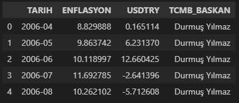

## 1.1. Matplotlib

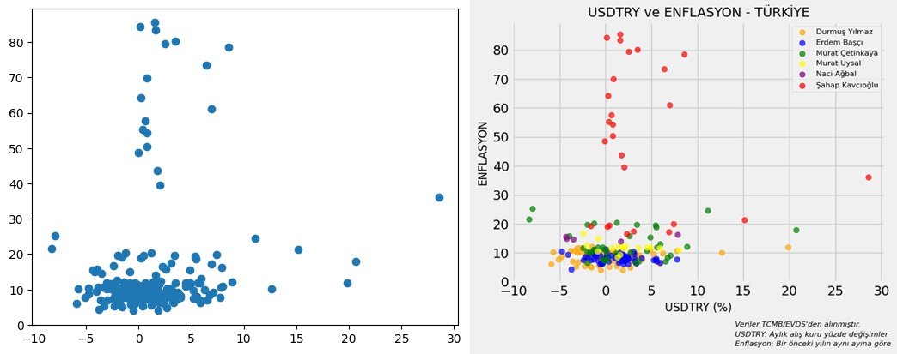

Basit bir grafik ile başlayalım.

```python
import matplotlib.pyplot as plt

plt.scatter(
    'USDTRY',
    'ENFLASYON',
    data=df
)
plt.show()
```

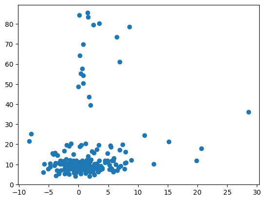

Başka neler yapabiliriz?

Noktaların rengini değiştirebiliriz.

```python
import matplotlib.pyplot as plt

plt.scatter(
    'USDTRY',
    'ENFLASYON',
    data=df,
    color='red'
)
plt.show()
```

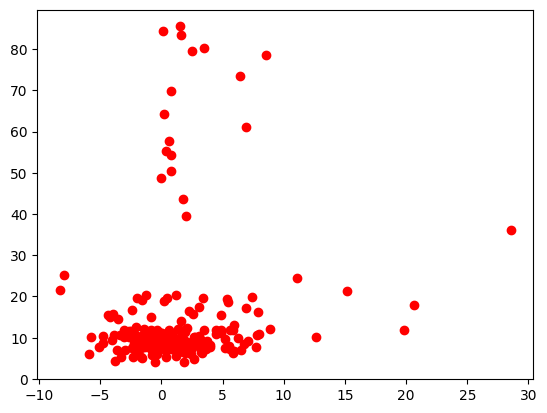

Yatay (x) ve dikey (y) eksenlerin etiketlerini belirtebilir; başlık ekleyebiliriz.

```python
import matplotlib.pyplot as plt

plt.scatter(
    'USDTRY',
    'ENFLASYON',
    data=df,
    color='red'
)
plt.xlabel('USDTRY (%)')
plt.ylabel('ENFLASYON')
plt.title('USDTRY ve ENFLASYON - TÜRKİYE')
plt.show()
```

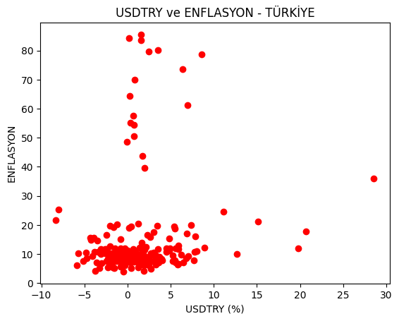

Alt tarafa bilgilendirme ekleyebiliriz.

```python
import matplotlib.pyplot as plt

plt.scatter(
    'USDTRY',
    'ENFLASYON',
    data=df,
    color='red'
)
plt.xlabel('USDTRY (%)')
plt.ylabel('ENFLASYON')
plt.title('USDTRY ve ENFLASYON - TÜRKİYE')
plt.figtext(0.55, -0.04, 'Veriler TCMB/EVDS\'den alınmıştır.', ha='left', fontsize='8', fontstyle='italic')
plt.figtext(0.55, -0.07, 'USDTRY: Aylık alış kuru yüzde değişimler', ha='left', fontsize='8', fontstyle='italic')
plt.figtext(0.55, -0.10, 'Enflasyon: Bir önceki yılın aynı ayına göre', ha='left', fontsize='8', fontstyle='italic')
plt.show()
```

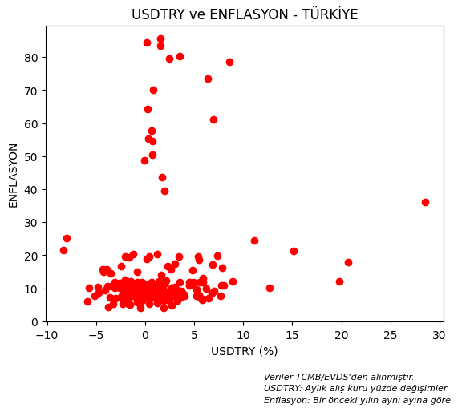

Noktaların rengini kategorilere göre ayarlayabiliriz.

```python
import matplotlib.pyplot as plt

kategori_renkleri = {
    'Durmuş Yılmaz': 'orange',
    'Erdem Başçı': 'blue',
    'Murat Çetinkaya': 'green',
    'Murat Uysal': 'yellow',
    'Naci Ağbal': 'purple',
    'Şahap Kavcıoğlu': 'red'
}

for kategori, renk in kategori_renkleri.items():
    kategoriler = df[df['TCMB_BASKAN'] == kategori]
    plt.scatter(
        kategoriler['USDTRY'],
        kategoriler['ENFLASYON'],
        color=renk
    )

plt.xlabel('USDTRY (%)')
plt.ylabel('ENFLASYON')
plt.title('USDTRY ve ENFLASYON - TÜRKİYE')
plt.figtext(0.55, -0.04, 'Veriler TCMB/EVDS\'den alınmıştır.', ha='left', fontsize='8', fontstyle='italic')
plt.figtext(0.55, -0.07, 'USDTRY: Aylık alış kuru yüzde değişimler', ha='left', fontsize='8', fontstyle='italic')
plt.figtext(0.55, -0.10, 'Enflasyon: Bir önceki yılın aynı ayına göre', ha='left', fontsize='8', fontstyle='italic')
plt.show()
```

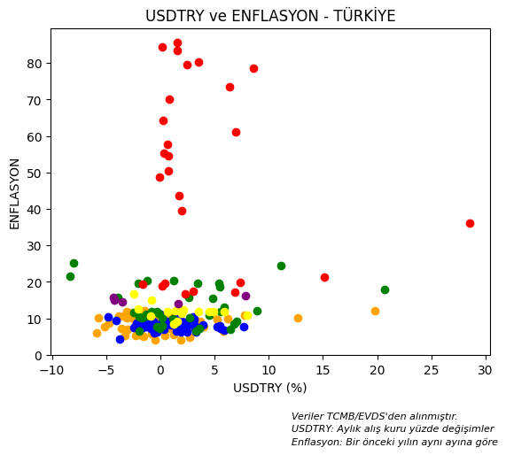

Bu tip noktaların iç içe geçtiği bir grafikte saydamlığı ayarlamak güzel bir fikir olabilir.

```python
import matplotlib.pyplot as plt

kategori_renkleri = {
    'Durmuş Yılmaz': 'orange',
    'Erdem Başçı': 'blue',
    'Murat Çetinkaya': 'green',
    'Murat Uysal': 'yellow',
    'Naci Ağbal': 'purple',
    'Şahap Kavcıoğlu': 'red'
}

for kategori, renk in kategori_renkleri.items():
    kategoriler = df[df['TCMB_BASKAN'] == kategori]
    plt.scatter(
        kategoriler['USDTRY'],
        kategoriler['ENFLASYON'],
        color=renk,
        alpha=0.7
    )

plt.xlabel('USDTRY (%)')
plt.ylabel('ENFLASYON')
plt.title('USDTRY ve ENFLASYON - TÜRKİYE')
plt.figtext(0.55, -0.04, 'Veriler TCMB/EVDS\'den alınmıştır.', ha='left', fontsize='8', fontstyle='italic')
plt.figtext(0.55, -0.07, 'USDTRY: Aylık alış kuru yüzde değişimler', ha='left', fontsize='8', fontstyle='italic')
plt.figtext(0.55, -0.10, 'Enflasyon: Bir önceki yılın aynı ayına göre', ha='left', fontsize='8', fontstyle='italic')
plt.show()
```

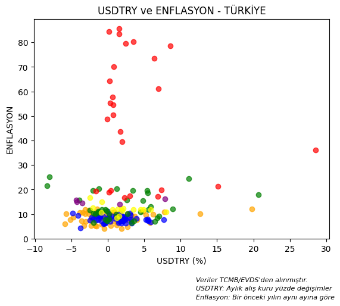

Kategori renklerini her zaman belirtmek zorunda değiliz. Bu durumda renk parametresi yazılmayabilir.

```python
import matplotlib.pyplot as plt

kategori_renkleri = {
    'Durmuş Yılmaz': 'orange',
    'Erdem Başçı': 'blue',
    'Murat Çetinkaya': 'green',
    'Murat Uysal': 'yellow',
    'Naci Ağbal': 'purple',
    'Şahap Kavcıoğlu': 'red'
}

for kategori, renk in kategori_renkleri.items():
    kategoriler = df[df['TCMB_BASKAN'] == kategori]
    plt.scatter(
        kategoriler['USDTRY'],
        kategoriler['ENFLASYON'],
        # color=renk,
        alpha=0.7
    )

plt.xlabel('USDTRY (%)')
plt.ylabel('ENFLASYON')
plt.title('USDTRY ve ENFLASYON - TÜRKİYE')
plt.figtext(0.55, -0.04, 'Veriler TCMB/EVDS\'den alınmıştır.', ha='left', fontsize='8', fontstyle='italic')
plt.figtext(0.55, -0.07, 'USDTRY: Aylık alış kuru yüzde değişimler', ha='left', fontsize='8', fontstyle='italic')
plt.figtext(0.55, -0.10, 'Enflasyon: Bir önceki yılın aynı ayına göre', ha='left', fontsize='8', fontstyle='italic')
plt.show()
```

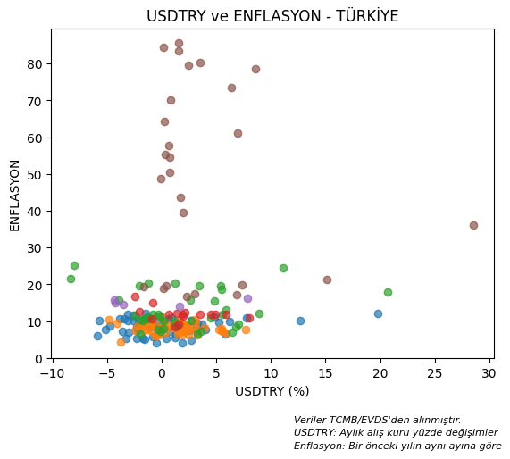

Lejant ekleyebiliriz.

```python
import matplotlib.pyplot as plt

kategori_renkleri = {
    'Durmuş Yılmaz': 'orange',
    'Erdem Başçı': 'blue',
    'Murat Çetinkaya': 'green',
    'Murat Uysal': 'yellow',
    'Naci Ağbal': 'purple',
    'Şahap Kavcıoğlu': 'red'
}

for kategori, renk in kategori_renkleri.items():
    kategoriler = df[df['TCMB_BASKAN'] == kategori]
    plt.scatter(
        kategoriler['USDTRY'],
        kategoriler['ENFLASYON'],
        color=renk,
        alpha=0.7,
        label=kategori
    )

plt.xlabel('USDTRY (%)')
plt.ylabel('ENFLASYON')
plt.title('USDTRY ve ENFLASYON - TÜRKİYE')
plt.figtext(0.55, -0.04, 'Veriler TCMB/EVDS\'den alınmıştır.', ha='left', fontsize='8', fontstyle='italic')
plt.figtext(0.55, -0.07, 'USDTRY: Aylık alış kuru yüzde değişimler', ha='left', fontsize='8', fontstyle='italic')
plt.figtext(0.55, -0.10, 'Enflasyon: Bir önceki yılın aynı ayına göre', ha='left', fontsize='8', fontstyle='italic')
plt.legend()
plt.show()
```

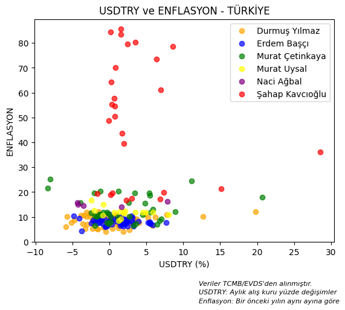

Temayı değiştirebiliriz. Tema değiştiği için lejantı, eksenlere ait etiketleri ve başlığı küçültebilir; alt bilginin konumunda ufak bir oynama yapabiliriz.

```python
import matplotlib.pyplot as plt

plt.style.use('fivethirtyeight')

kategori_renkleri = {
    'Durmuş Yılmaz': 'orange',
    'Erdem Başçı': 'blue',
    'Murat Çetinkaya': 'green',
    'Murat Uysal': 'yellow',
    'Naci Ağbal': 'purple',
    'Şahap Kavcıoğlu': 'red'
}

for kategori, renk in kategori_renkleri.items():
    kategoriler = df[df['TCMB_BASKAN'] == kategori]
    plt.scatter(
        kategoriler['USDTRY'],
        kategoriler['ENFLASYON'],
        color=renk,
        alpha=0.7,
        label=kategori
    )

plt.xlabel('USDTRY (%)', fontsize='12')
plt.ylabel('ENFLASYON', fontsize='12')
plt.title('USDTRY ve ENFLASYON - TÜRKİYE', fontsize='14')
plt.figtext(0.6, -0.07, 'Veriler TCMB/EVDS\'den alınmıştır.', ha='left', fontsize='8', fontstyle='italic')
plt.figtext(0.6, -0.10, 'USDTRY: Aylık alış kuru yüzde değişimler', ha='left', fontsize='8', fontstyle='italic')
plt.figtext(0.6, -0.13, 'Enflasyon: Bir önceki yılın aynı ayına göre', ha='left', fontsize='8', fontstyle='italic')
plt.rcParams['legend.fontsize'] = 'xx-small'
plt.legend()
plt.show()
```

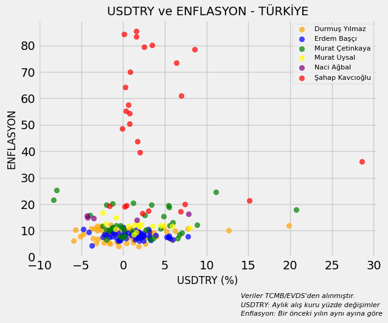

Son olarak, grafikte dikkat çeken bir kategoriye ait noktaları üçgen olarak gösterebiliriz.

```python
import matplotlib.pyplot as plt

plt.style.use('fivethirtyeight')

kategori_renkleri = {
    'Durmuş Yılmaz': 'orange',
    'Erdem Başçı': 'blue',
    'Murat Çetinkaya': 'green',
    'Murat Uysal': 'yellow',
    'Naci Ağbal': 'purple',
    'Şahap Kavcıoğlu': 'red'
}

for kategori, renk in kategori_renkleri.items():
    kategoriler = df[df['TCMB_BASKAN'] == kategori]
    marker = 'o'
    if kategori == 'Şahap Kavcıoğlu':
        marker = '^'
    plt.scatter(
        kategoriler['USDTRY'],
        kategoriler['ENFLASYON'],
        color=renk,
        alpha=0.7,
        label=kategori,
        marker=marker
    )

plt.xlabel('USDTRY (%)', fontsize='12')
plt.ylabel('ENFLASYON', fontsize='12')
plt.title('USDTRY ve ENFLASYON - TÜRKİYE', fontsize='14')
plt.figtext(0.6, -0.07, 'Veriler TCMB/EVDS\'den alınmıştır.', ha='left', fontsize='8', fontstyle='italic')
plt.figtext(0.6, -0.10, 'USDTRY: Aylık alış kuru yüzde değişimler', ha='left', fontsize='8', fontstyle='italic')
plt.figtext(0.6, -0.13, 'Enflasyon: Bir önceki yılın aynı ayına göre', ha='left', fontsize='8', fontstyle='italic')
plt.rcParams['legend.fontsize'] = 'xx-small'
plt.legend()
plt.show()
```

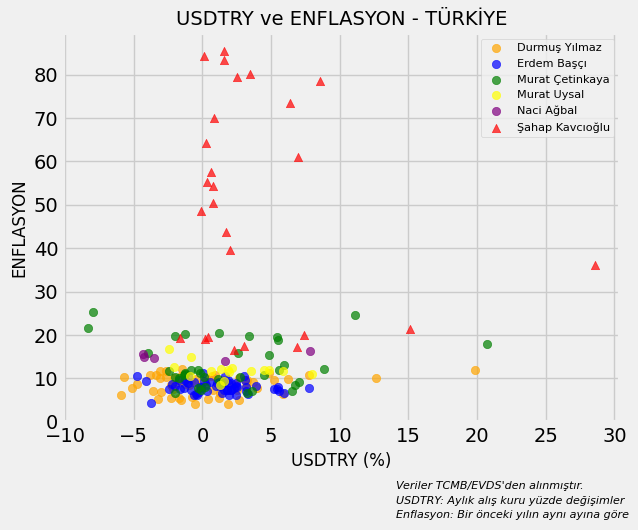

# 2. Line Graph

---

Veri: `linegraph_data.xlsx` (veriye [buradan](https://github.com/urazakgul/python-veri-gorsellestirme-dersleri/tree/main/data) ulaşabilirsiniz).

```python
import pandas as pd

df = pd.read_excel('./data/linegraph_data.xlsx')
df['TARIH'] = pd.to_datetime(df['TARIH'], format='%Y-%m-%d')
df.head()
```

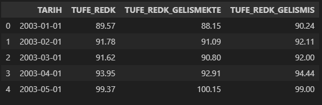

## 2.1. Matplotlib

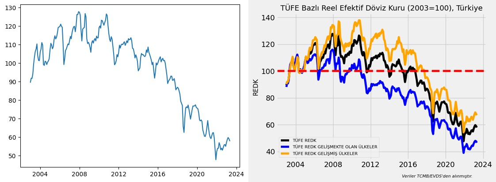

Basit bir grafik ile başlayalım.

```python
import matplotlib.pyplot as plt

plt.plot(
    'TARIH',
    'TUFE_REDK',
    data=df
)
plt.show()
```

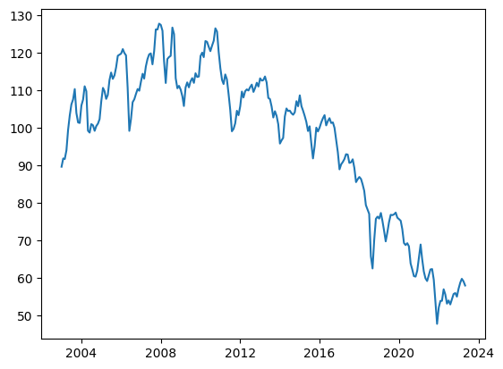

Başka neler yapabiliriz?

Çizginin rengini değiştirebiliriz.

```python
import matplotlib.pyplot as plt

plt.plot(
    'TARIH',
    'TUFE_REDK',
    data=df,
    color='red'
)
plt.show()
```

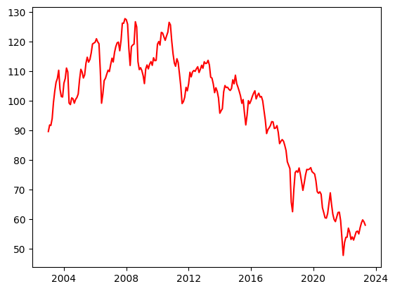

Yatay (x) ve dikey (y) eksenlerin etiketlerini belirtebilir; başlık ekleyebiliriz. Burada, yatay (x) ekseni etiketinin belirtilmesine gerek duyulmayabilir.

```python
import matplotlib.pyplot as plt

plt.plot(
    'TARIH',
    'TUFE_REDK',
    data=df,
    color='red'
)
plt.ylabel('REDK')
plt.title('TÜFE Bazlı Reel Efektif Döviz Kuru (2003=100), Türkiye')
plt.show()
```

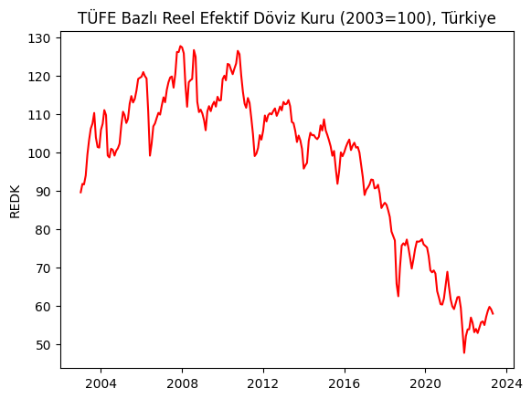

Alt tarafa bilgilendirme ekleyebiliriz.

```python
import matplotlib.pyplot as plt

plt.plot(
    'TARIH',
    'TUFE_REDK',
    data=df,
    color='red'
)
plt.ylabel('REDK')
plt.title('TÜFE Bazlı Reel Efektif Döviz Kuru (2003=100), Türkiye')
plt.figtext(0.6, -0.03, 'Veriler TCMB/EVDS\'den alınmıştır.', ha='left', fontsize='8', fontstyle='italic')
plt.show()
```

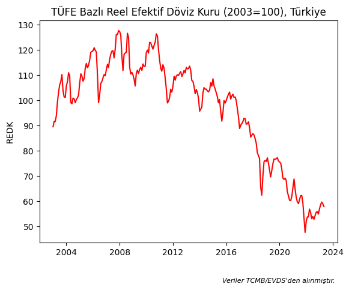

100 değerini baz alarak yatay bir çizgi ekleyebiliriz.

```python
import matplotlib.pyplot as plt

plt.plot(
    'TARIH',
    'TUFE_REDK',
    data=df,
    color='red'
)
plt.ylabel('REDK')
plt.title('TÜFE Bazlı Reel Efektif Döviz Kuru (2003=100), Türkiye')
plt.figtext(0.6, -0.03, 'Veriler TCMB/EVDS\'den alınmıştır.', ha='left', fontsize='8', fontstyle='italic')
plt.axhline(y=100, color='black', linestyle='--')
plt.show()
```

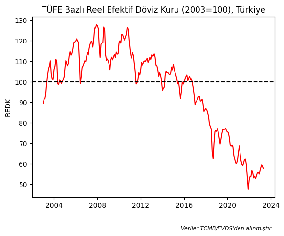

Çoklu çizgi grafik yapabiliriz.

```python
import matplotlib.pyplot as plt

plt.plot(
    'TARIH',
    'TUFE_REDK',
    data=df,
    color='black'
)
plt.plot(
    'TARIH',
    'TUFE_REDK_GELISMEKTE',
    data=df,
    color='blue'
)
plt.plot(
    'TARIH',
    'TUFE_REDK_GELISMIS',
    data=df,
    color='orange'
)
plt.ylabel('REDK')
plt.title('TÜFE Bazlı Reel Efektif Döviz Kuru (2003=100), Türkiye')
plt.figtext(0.6, -0.03, 'Veriler TCMB/EVDS\'den alınmıştır.', ha='left', fontsize='8', fontstyle='italic')
plt.axhline(y=100, color='red', linestyle='--')
plt.show()
```

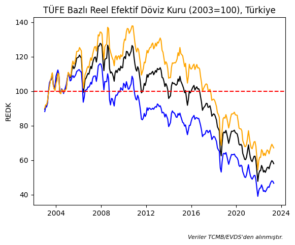

Lejant ekleyebiliriz.

```python
import matplotlib.pyplot as plt

plt.plot(
    'TARIH',
    'TUFE_REDK',
    data=df,
    color='black'
)
plt.plot(
    'TARIH',
    'TUFE_REDK_GELISMEKTE',
    data=df,
    color='blue'
)
plt.plot(
    'TARIH',
    'TUFE_REDK_GELISMIS',
    data=df,
    color='orange'
)
plt.ylabel('REDK')
plt.title('TÜFE Bazlı Reel Efektif Döviz Kuru (2003=100), Türkiye')
plt.figtext(0.6, -0.03, 'Veriler TCMB/EVDS\'den alınmıştır.', ha='left', fontsize='8', fontstyle='italic')
plt.axhline(y=100, color='red', linestyle='--')
plt.legend()
plt.show()
```

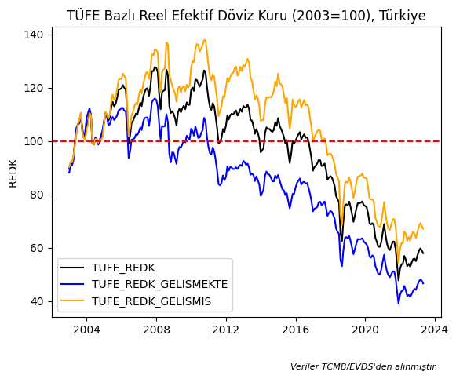

Lejantı küçültebiliriz.

```python
import matplotlib.pyplot as plt

plt.plot(
    'TARIH',
    'TUFE_REDK',
    data=df,
    color='black'
)
plt.plot(
    'TARIH',
    'TUFE_REDK_GELISMEKTE',
    data=df,
    color='blue'
)
plt.plot(
    'TARIH',
    'TUFE_REDK_GELISMIS',
    data=df,
    color='orange'
)
plt.ylabel('REDK')
plt.title('TÜFE Bazlı Reel Efektif Döviz Kuru (2003=100), Türkiye')
plt.figtext(0.6, -0.03, 'Veriler TCMB/EVDS\'den alınmıştır.', ha='left', fontsize='8', fontstyle='italic')
plt.axhline(y=100, color='red', linestyle='--')
plt.legend(fontsize='xx-small')
plt.show()
```

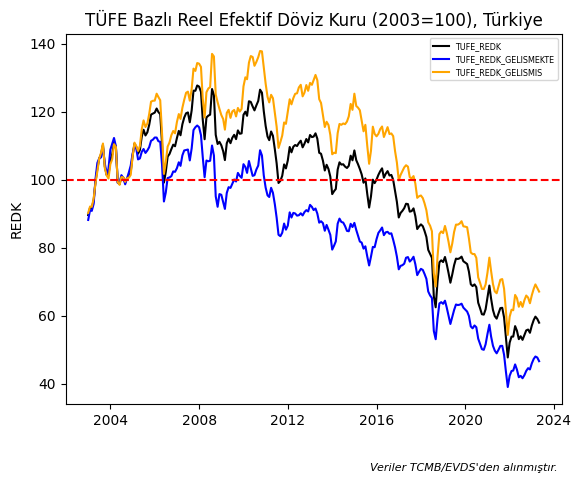

Sağ üst tarafa konumlanan lejantı sol alt tarafa alabiliriz.

```python
import matplotlib.pyplot as plt

plt.plot(
    'TARIH',
    'TUFE_REDK',
    data=df,
    color='black'
)
plt.plot(
    'TARIH',
    'TUFE_REDK_GELISMEKTE',
    data=df,
    color='blue'
)
plt.plot(
    'TARIH',
    'TUFE_REDK_GELISMIS',
    data=df,
    color='orange'
)
plt.ylabel('REDK')
plt.title('TÜFE Bazlı Reel Efektif Döviz Kuru (2003=100), Türkiye')
plt.figtext(0.6, -0.03, 'Veriler TCMB/EVDS\'den alınmıştır.', ha='left', fontsize='8', fontstyle='italic')
plt.axhline(y=100, color='red', linestyle='--')
plt.legend(fontsize='xx-small', loc='lower left')
plt.show()
```

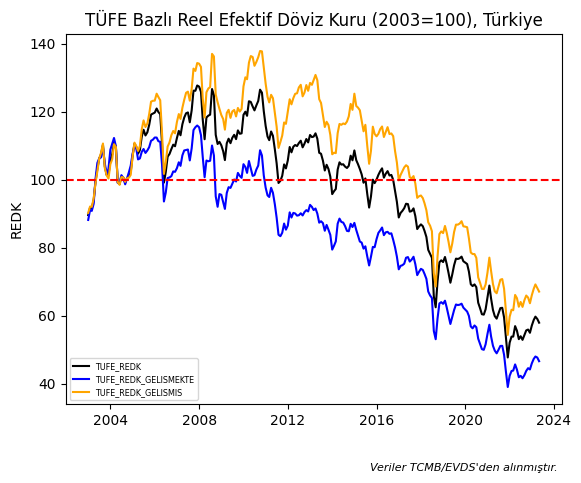

Lejantların etiketleri alt çizgili pek profesyonel durmuyor. Etiketleri değiştirebiliriz.

```python
import matplotlib.pyplot as plt

plt.plot(
    'TARIH',
    'TUFE_REDK',
    data=df,
    color='black',
    label='TÜFE REDK'
)
plt.plot(
    'TARIH',
    'TUFE_REDK_GELISMEKTE',
    data=df,
    color='blue',
    label='TÜFE REDK GELİŞMEKTE OLAN ÜLKELER'
)
plt.plot(
    'TARIH',
    'TUFE_REDK_GELISMIS',
    data=df,
    color='orange',
    label='TÜFE REDK GELİŞMİŞ ÜLKELER'
)
plt.ylabel('REDK')
plt.title('TÜFE Bazlı Reel Efektif Döviz Kuru (2003=100), Türkiye')
plt.figtext(0.6, -0.03, 'Veriler TCMB/EVDS\'den alınmıştır.', ha='left', fontsize='8', fontstyle='italic')
plt.axhline(y=100, color='red', linestyle='--')
plt.legend(fontsize='xx-small', loc='lower left')
plt.show()
```


Temayı değiştirebiliriz. Tema değiştiği için eksenlere ait etiketleri ve başlığı küçültebiliriz.

```python
import matplotlib.pyplot as plt

plt.style.use('fivethirtyeight')

plt.plot(
    'TARIH',
    'TUFE_REDK',
    data=df,
    color='black',
    label='TÜFE REDK'
)
plt.plot(
    'TARIH',
    'TUFE_REDK_GELISMEKTE',
    data=df,
    color='blue',
    label='TÜFE REDK GELİŞMEKTE OLAN ÜLKELER'
)
plt.plot(
    'TARIH',
    'TUFE_REDK_GELISMIS',
    data=df,
    color='orange',
    label='TÜFE REDK GELİŞMİŞ ÜLKELER'
)
plt.ylabel('REDK', fontsize='12')
plt.title('TÜFE Bazlı Reel Efektif Döviz Kuru (2003=100), Türkiye', fontsize='14')
plt.figtext(0.6, -0.03, 'Veriler TCMB/EVDS\'den alınmıştır.', ha='left', fontsize='8', fontstyle='italic')
plt.axhline(y=100, color='red', linestyle='--')
plt.legend(fontsize='xx-small', loc='lower left')
plt.show()
```

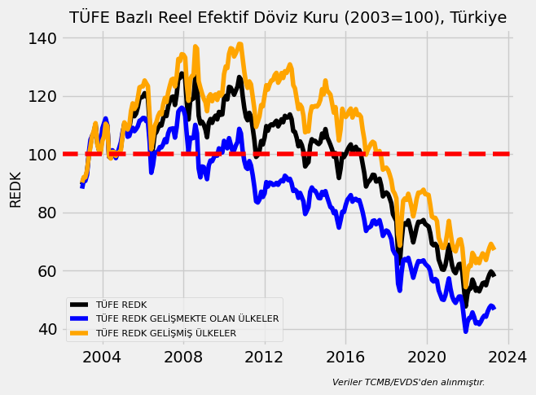

# 3. Histogram

---

Veri: `histogram_data.xlsx` (veriye [buradan](https://github.com/urazakgul/python-veri-gorsellestirme-dersleri/tree/main/data) ulaşabilirsiniz).

```python
import pandas as pd

df = pd.read_excel('./data/histogram_data.xlsx')
df.head()
```

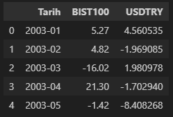

## 3.1. Matplotlib

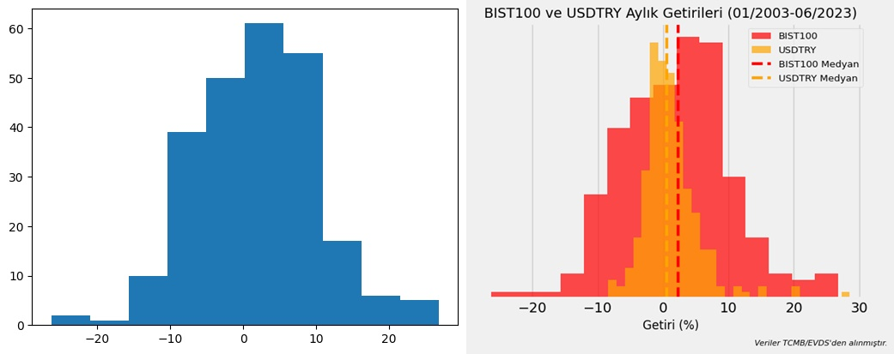

Basit bir grafik ile başlayalım.

```python
import matplotlib.pyplot as plt

plt.hist(
    'BIST100',
    data=df
)
plt.show()
```

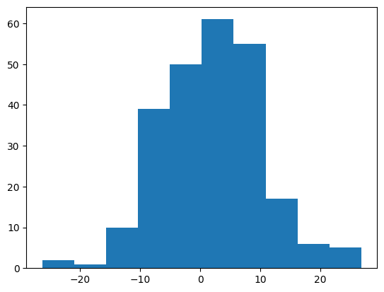

Başka neler yapabiliriz?

Histogram'ın rengini değiştirebiliriz.

```python
import matplotlib.pyplot as plt

plt.hist(
    'BIST100',
    data=df,
    color='red'
)
plt.show()
```

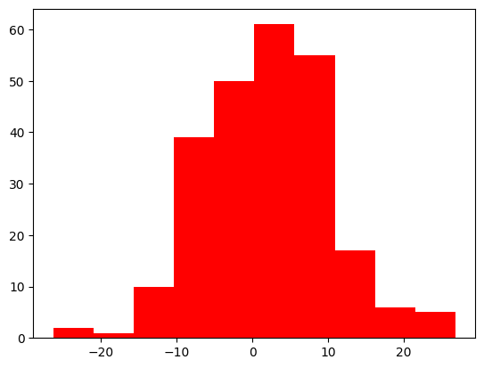

Yatay (x) ve dikey (y) eksenlerin etiketlerini belirtebilir; başlık ekleyebiliriz.

```python
import matplotlib.pyplot as plt

plt.hist(
    'BIST100',
    data=df,
    color='red'
)
plt.xlabel('Getiri (%)')
plt.ylabel('Frekans')
plt.title('BIST100 Aylık Getirileri (01/2003-06/2023)')
plt.show()
```


Alt tarafa bilgilendirme ekleyebiliriz.

```python
import matplotlib.pyplot as plt

plt.hist(
    'BIST100',
    data=df,
    color='red'
)
plt.xlabel('Getiri (%)')
plt.ylabel('Frekans')
plt.title('BIST100 Aylık Getirileri (01/2003-06/2023)')
plt.figtext(0.6, -0.04, 'Veriler TCMB/EVDS\'den alınmıştır.', ha='left', fontsize='8', fontstyle='italic')
plt.show()
```

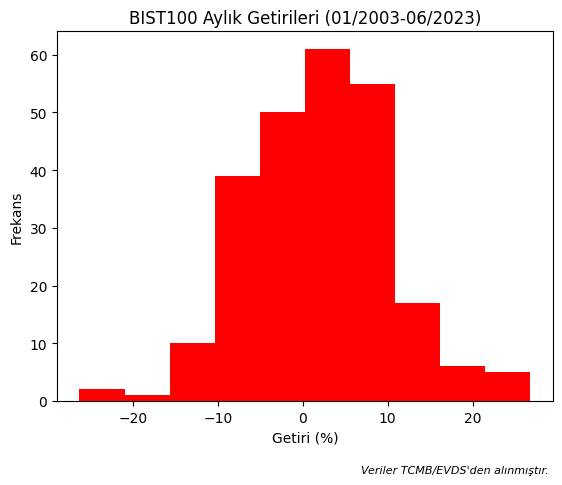

Histogram tipinde dikey (y) eksenin kalması çoğu zaman anlamlı olmuyor. Burayı kaldırabiliriz.

```python
import matplotlib.pyplot as plt

plt.hist(
    'BIST100',
    data=df,
    color='red'
)
plt.xlabel('Getiri (%)')
plt.title('BIST100 Aylık Getirileri (01/2003-06/2023)')
plt.figtext(0.6, -0.04, 'Veriler TCMB/EVDS\'den alınmıştır.', ha='left', fontsize='8', fontstyle='italic')
plt.yticks([])
plt.show()
```

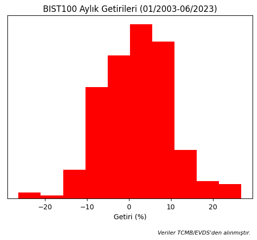

Histogram'da kullanılan sütun sayısını belirleyebiliriz.

```python
import matplotlib.pyplot as plt

plt.hist(
    'BIST100',
    data=df,
    color='red',
    bins=20
)
plt.xlabel('Getiri (%)')
plt.title('BIST100 Aylık Getirileri (01/2003-06/2023)')
plt.figtext(0.6, -0.04, 'Veriler TCMB/EVDS\'den alınmıştır.', ha='left', fontsize='8', fontstyle='italic')
plt.yticks([])
plt.show()
```

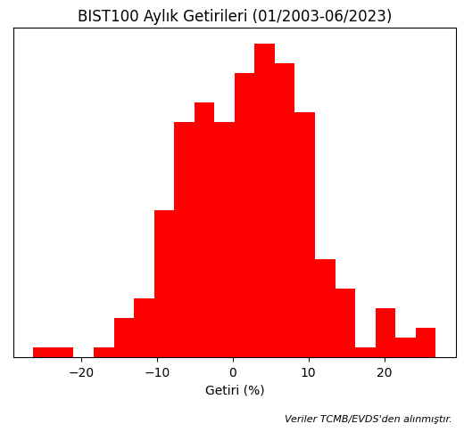

Histogram'da kullanılan sütun sayısını otomatik olacak şekilde de belirleyebiliriz.

```python
import matplotlib.pyplot as plt

plt.hist(
    'BIST100',
    data=df,
    color='red',
    bins='auto'
)
plt.xlabel('Getiri (%)')
plt.title('BIST100 Aylık Getirileri (01/2003-06/2023)')
plt.figtext(0.6, -0.04, 'Veriler TCMB/EVDS\'den alınmıştır.', ha='left', fontsize='8', fontstyle='italic')
plt.yticks([])
plt.show()
```

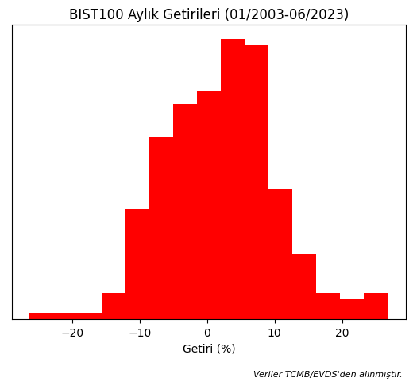

Sıfır noktasından dikey bir çizgi ekleyebiliriz.

```python
import matplotlib.pyplot as plt

plt.hist(
    'BIST100',
    data=df,
    color='red',
    bins='auto'
)
plt.xlabel('Getiri (%)')
plt.title('BIST100 Aylık Getirileri (01/2003-06/2023)')
plt.figtext(0.6, -0.04, 'Veriler TCMB/EVDS\'den alınmıştır.', ha='left', fontsize='8', fontstyle='italic')
plt.yticks([])
plt.axvline(x=0, color='black', linestyle='--')
plt.show()
```


Bir değişken daha ekleyebiliriz.

```python
import matplotlib.pyplot as plt

plt.hist(
    'BIST100',
    data=df,
    color='red',
    bins='auto'
)
plt.hist(
    'USDTRY',
    data=df,
    color='orange',
    bins='auto'
)
plt.xlabel('Getiri (%)')
plt.title('BIST100 ve USDTRY Aylık Getirileri (01/2003-06/2023)')
plt.figtext(0.6, -0.04, 'Veriler TCMB/EVDS\'den alınmıştır.', ha='left', fontsize='8', fontstyle='italic')
plt.yticks([])
plt.axvline(x=0, color='black', linestyle='--')
plt.show()
```

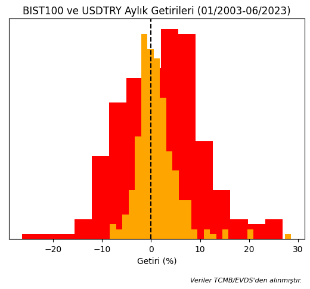

Saydamlığı ayarlayabiliriz.

```python
import matplotlib.pyplot as plt

plt.hist(
    'BIST100',
    data=df,
    color='red',
    bins='auto',
    alpha=0.7
)
plt.hist(
    'USDTRY',
    data=df,
    color='orange',
    bins='auto',
    alpha=0.7
)
plt.xlabel('Getiri (%)')
plt.title('BIST100 ve USDTRY Aylık Getirileri (01/2003-06/2023)')
plt.figtext(0.6, -0.04, 'Veriler TCMB/EVDS\'den alınmıştır.', ha='left', fontsize='8', fontstyle='italic')
plt.yticks([])
plt.axvline(x=0, color='black', linestyle='--')
plt.show()
```

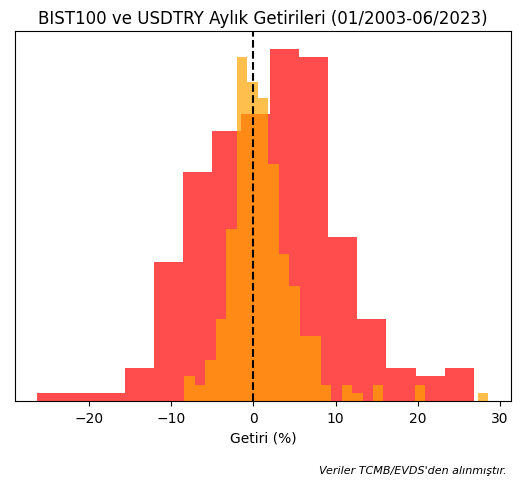

Lejant ekleyebiliriz.

```python
import matplotlib.pyplot as plt

plt.hist(
    'BIST100',
    data=df,
    color='red',
    bins='auto',
    alpha=0.7,
    label='BIST100'
)
plt.hist(
    'USDTRY',
    data=df,
    color='orange',
    bins='auto',
    alpha=0.7,
    label='USDTRY'
)
plt.xlabel('Getiri (%)')
plt.title('BIST100 ve USDTRY Aylık Getirileri (01/2003-06/2023)')
plt.figtext(0.6, -0.04, 'Veriler TCMB/EVDS\'den alınmıştır.', ha='left', fontsize='8', fontstyle='italic')
plt.yticks([])
plt.axvline(x=0, color='black', linestyle='--')
plt.legend()
plt.show()
```


Dikey çizgiyi sıfır yapmak yerine her iki değişkenin medyan değeri olacak şekilde de yapabiliriz.

```python
import matplotlib.pyplot as plt
import numpy as np

medyan_bist100 = np.median(df['BIST100'])
medyan_usdtry = np.median(df['USDTRY'])

plt.hist(
    'BIST100',
    data=df,
    color='red',
    bins='auto',
    alpha=0.7,
    label='BIST100'
)
plt.hist(
    'USDTRY',
    data=df,
    color='orange',
    bins='auto',
    alpha=0.7,
    label='USDTRY'
)
plt.xlabel('Getiri (%)')
plt.title('BIST100 ve USDTRY Aylık Getirileri (01/2003-06/2023)')
plt.figtext(0.6, -0.04, 'Veriler TCMB/EVDS\'den alınmıştır.', ha='left', fontsize='8', fontstyle='italic')
plt.yticks([])
plt.axvline(x=medyan_bist100, color='red', linestyle='--', linewidth='3', label='BIST100 Medyan')
plt.axvline(x=medyan_usdtry, color='orange', linestyle='--', linewidth='3', label='USDTRY Medyan')
plt.legend()
plt.show()
```

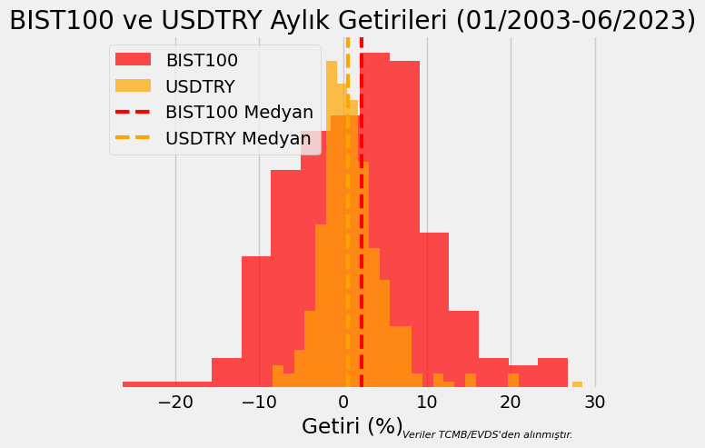

Lejantı büyük geldiği için küçültebiliriz.

```python
import matplotlib.pyplot as plt
import numpy as np

medyan_bist100 = np.median(df['BIST100'])
medyan_usdtry = np.median(df['USDTRY'])

plt.hist(
    'BIST100',
    data=df,
    color='red',
    bins='auto',
    alpha=0.7,
    label='BIST100'
)
plt.hist(
    'USDTRY',
    data=df,
    color='orange',
    bins='auto',
    alpha=0.7,
    label='USDTRY'
)
plt.xlabel('Getiri (%)')
plt.title('BIST100 ve USDTRY Aylık Getirileri (01/2003-06/2023)')
plt.figtext(0.6, -0.04, 'Veriler TCMB/EVDS\'den alınmıştır.', ha='left', fontsize='8', fontstyle='italic')
plt.yticks([])
plt.axvline(x=medyan_bist100, color='red', linestyle='--', linewidth='3', label='BIST100 Medyan')
plt.axvline(x=medyan_usdtry, color='orange', linestyle='--', linewidth='3', label='USDTRY Medyan')
plt.rcParams['legend.fontsize'] = 'x-small'
plt.legend()
plt.show()
```

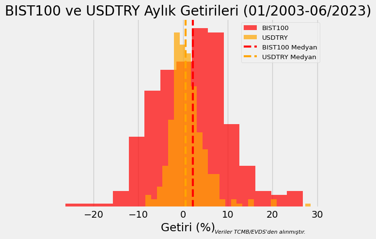

Temayı değiştirebiliriz. Tema değiştiği için eksenlere ait etiketleri ve başlığı küçültebiliriz.

```python
import matplotlib.pyplot as plt
import numpy as np

plt.style.use('fivethirtyeight')

medyan_bist100 = np.median(df['BIST100'])
medyan_usdtry = np.median(df['USDTRY'])

plt.hist(
    'BIST100',
    data=df,
    color='red',
    bins='auto',
    alpha=0.7,
    label='BIST100'
)
plt.hist(
    'USDTRY',
    data=df,
    color='orange',
    bins='auto',
    alpha=0.7,
    label='USDTRY'
)
plt.xlabel('Getiri (%)', fontsize='12')
plt.title('BIST100 ve USDTRY Aylık Getirileri (01/2003-06/2023)', fontsize='14')
plt.figtext(0.7, -0.07, 'Veriler TCMB/EVDS\'den alınmıştır.', ha='left', fontsize='8', fontstyle='italic')
plt.yticks([])
plt.axvline(x=medyan_bist100, color='red', linestyle='--', linewidth='3', label='BIST100 Medyan')
plt.axvline(x=medyan_usdtry, color='orange', linestyle='--', linewidth='3', label='USDTRY Medyan')
plt.rcParams['legend.fontsize'] = 'x-small'
plt.legend()
plt.show()
```

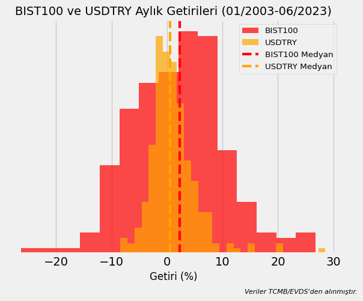

# 4. Bar Chart

---

Veri: `barchart_data.xlsx` (veriye [buradan](https://github.com/urazakgul/python-veri-gorsellestirme-dersleri/tree/main/data) ulaşabilirsiniz).

```python
import pandas as pd

df = pd.read_excel('./data/barchart_data.xlsx')
df.head()
```


## 4.1. Matplotlib

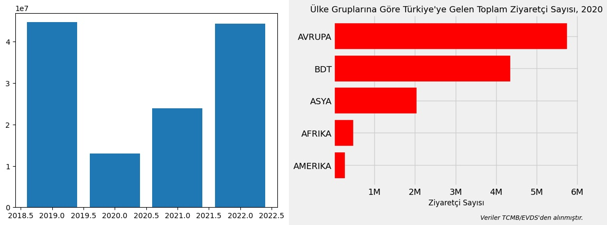

Basit bir grafik ile başlayalım.

```python
import matplotlib.pyplot as plt

plt.bar(
    'TARIH',
    'TOPLAM',
    data=df
)
plt.show()
```

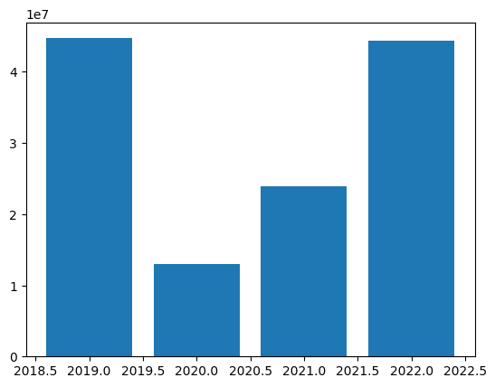

Başka neler yapabiliriz?

Yatay (x) eksendeki yılları düzeltebiliriz.

```python
import matplotlib.pyplot as plt

df['TARIH'] = df['TARIH'].astype(str)

plt.bar(
    'TARIH',
    'TOPLAM',
    data=df
)
plt.show()
```

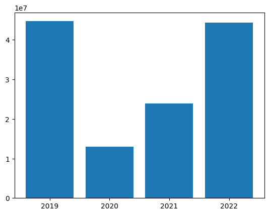

Dikey (y) eksen değerleri milyon cinsinden ifade edilebileceği için buranın formatını daha okunabilir hale getirebiliriz.

```python
import matplotlib.pyplot as plt
import matplotlib.ticker as ticker

df['TARIH'] = df['TARIH'].astype(str)

plt.bar(
    'TARIH',
    'TOPLAM',
    data=df
)
formatter = ticker.FuncFormatter(lambda x, pos: '{:,.0f}'.format(x/1000000) + 'M' if x != 0 else '')
plt.gca().yaxis.set_major_formatter(formatter)
plt.show()
```

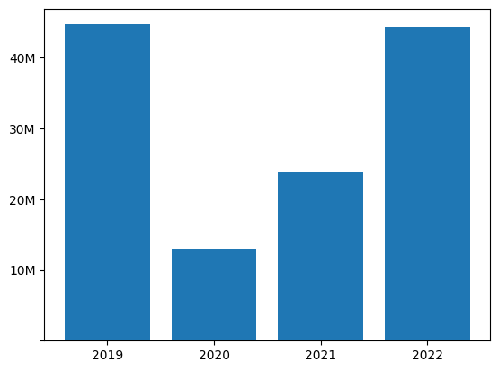

Çubukların rengini değiştirebiliriz.

```python
import matplotlib.pyplot as plt
import matplotlib.ticker as ticker

df['TARIH'] = df['TARIH'].astype(str)

plt.bar(
    'TARIH',
    'TOPLAM',
    data=df,
    color='red'
)
formatter = ticker.FuncFormatter(lambda x, pos: '{:,.0f}'.format(x/1000000) + 'M' if x != 0 else '')
plt.gca().yaxis.set_major_formatter(formatter)
plt.show()
```

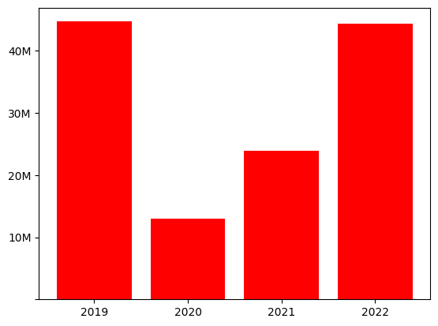

Yatay (x) eksenin etiketini belirtebilir; başlık ekleyebiliriz.

```python
import matplotlib.pyplot as plt
import matplotlib.ticker as ticker

df['TARIH'] = df['TARIH'].astype(str)

plt.bar(
    'TARIH',
    'TOPLAM',
    data=df,
    color='red'
)
formatter = ticker.FuncFormatter(lambda x, pos: '{:,.0f}'.format(x/1000000) + 'M' if x != 0 else '')
plt.gca().yaxis.set_major_formatter(formatter)
plt.ylabel('Ziyaretçi Sayısı')
plt.title('Yıllara Göre Türkiye\'ye Gelen Toplam Ziyaretçi Sayısı')
plt.show()
```

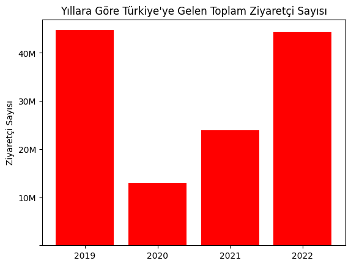

Alt tarafa bilgilendirme ekleyebiliriz.

```python
import matplotlib.pyplot as plt
import matplotlib.ticker as ticker

df['TARIH'] = df['TARIH'].astype(str)

plt.bar(
    'TARIH',
    'TOPLAM',
    data=df,
    color='red'
)
formatter = ticker.FuncFormatter(lambda x, pos: '{:,.0f}'.format(x/1000000) + 'M' if x != 0 else '')
plt.gca().yaxis.set_major_formatter(formatter)
plt.ylabel('Ziyaretçi Sayısı')
plt.title('Yıllara Göre Türkiye\'ye Gelen Toplam Ziyaretçi Sayısı')
plt.figtext(0.6, -0.06, 'Veriler TCMB/EVDS\'den alınmıştır.', ha='left', fontsize='8', fontstyle='italic')
plt.show()
```

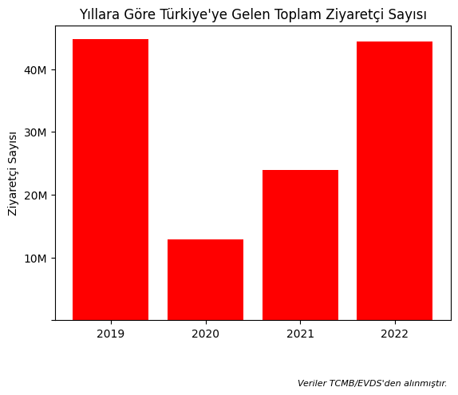

Yatay (x) ekseni başka bir kategori olarak da alabiliriz.

```python
import matplotlib.pyplot as plt
import matplotlib.ticker as ticker

df['TARIH'] = df['TARIH'].astype(str)

df2 = pd.melt(
    df,
    id_vars='TARIH', value_vars=['AVRUPA', 'BDT', 'AMERIKA', 'AFRIKA', 'ASYA'],
    var_name='GRUP',
    value_name='SAYI'
)
df2 = df2[df2['TARIH'] == '2020']

plt.bar(
    'GRUP',
    'SAYI',
    data=df2,
    color='red'
)
formatter = ticker.FuncFormatter(lambda x, pos: '{:,.0f}'.format(x/1000000) + 'M' if x != 0 else '')
plt.gca().yaxis.set_major_formatter(formatter)
plt.ylabel('Ziyaretçi Sayısı')
plt.title('Ülke Gruplarına Göre Türkiye\'ye Gelen Toplam Ziyaretçi Sayısı, 2020')
plt.figtext(0.6, -0.04, 'Veriler TCMB/EVDS\'den alınmıştır.', ha='left', fontsize='8', fontstyle='italic')
plt.show()
```

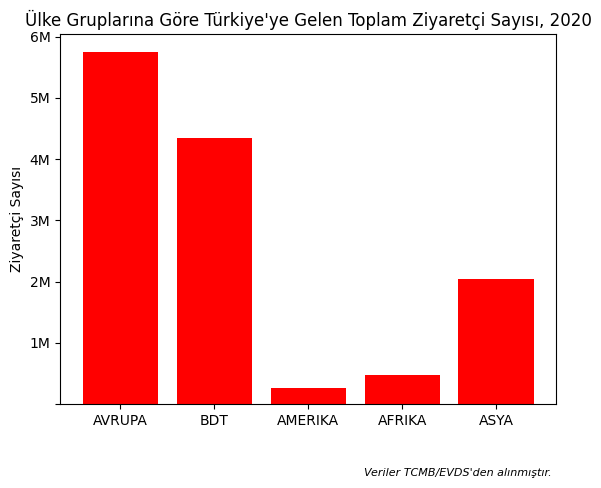

Kategorileri değerlerine göre büyükten küçüğe doğru sırayalabiliriz.

```python
import matplotlib.pyplot as plt
import matplotlib.ticker as ticker

df['TARIH'] = df['TARIH'].astype(str)

df2 = pd.melt(
    df,
    id_vars='TARIH', value_vars=['AVRUPA', 'BDT', 'AMERIKA', 'AFRIKA', 'ASYA'],
    var_name='GRUP',
    value_name='SAYI'
)
df2 = df2[df2['TARIH'] == '2020']

df_sirala = df2.sort_values('SAYI', ascending=False)

plt.bar(
    'GRUP',
    'SAYI',
    data=df_sirala,
    color='red'
)
formatter = ticker.FuncFormatter(lambda x, pos: '{:,.0f}'.format(x/1000000) + 'M' if x != 0 else '')
plt.gca().yaxis.set_major_formatter(formatter)
plt.ylabel('Ziyaretçi Sayısı')
plt.title('Ülke Gruplarına Göre Türkiye\'ye Gelen Toplam Ziyaretçi Sayısı, 2020')
plt.figtext(0.6, -0.04, 'Veriler TCMB/EVDS\'den alınmıştır.', ha='left', fontsize='8', fontstyle='italic')
plt.show()
```

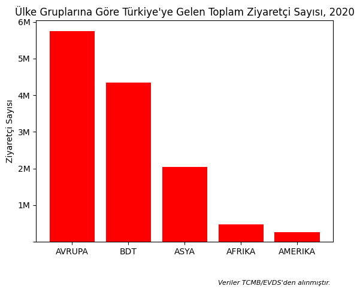

Grafiği çevirebiliriz.

```python
import matplotlib.pyplot as plt
import matplotlib.ticker as ticker

df['TARIH'] = df['TARIH'].astype(str)

df2 = pd.melt(
    df,
    id_vars='TARIH', value_vars=['AVRUPA', 'BDT', 'AMERIKA', 'AFRIKA', 'ASYA'],
    var_name='GRUP',
    value_name='SAYI'
)
df2 = df2[df2['TARIH'] == '2020']

df_sirala = df2.sort_values('SAYI', ascending=True)

plt.barh(
    'GRUP',
    'SAYI',
    data=df_sirala,
    color='red'
)
formatter = ticker.FuncFormatter(lambda x, pos: '{:,.0f}'.format(x/1000000) + 'M' if x != 0 else '')
plt.gca().xaxis.set_major_formatter(formatter)
plt.xlabel('Ziyaretçi Sayısı')
plt.title('Ülke Gruplarına Göre Türkiye\'ye Gelen Toplam Ziyaretçi Sayısı, 2020')
plt.figtext(0.6, -0.04, 'Veriler TCMB/EVDS\'den alınmıştır.', ha='left', fontsize='8', fontstyle='italic')
plt.show()
```

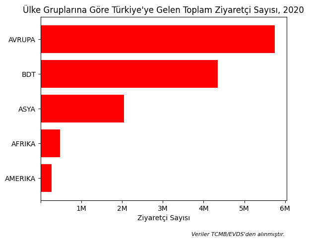

Temayı değiştirebiliriz. Tema değiştiği için eksenlere ait etiketleri ve başlığı küçültebiliriz.

```python
import matplotlib.pyplot as plt
import matplotlib.ticker as ticker

plt.style.use('fivethirtyeight')

df['TARIH'] = df['TARIH'].astype(str)

df2 = pd.melt(
    df,
    id_vars='TARIH', value_vars=['AVRUPA', 'BDT', 'AMERIKA', 'AFRIKA', 'ASYA'],
    var_name='GRUP',
    value_name='SAYI'
)
df2 = df2[df2['TARIH'] == '2020']

df_sirala = df2.sort_values('SAYI', ascending=True)

plt.barh(
    'GRUP',
    'SAYI',
    data=df_sirala,
    color='red'
)
formatter = ticker.FuncFormatter(lambda x, pos: '{:,.0f}'.format(x/1000000) + 'M' if x != 0 else '')
plt.gca().xaxis.set_major_formatter(formatter)
plt.xlabel('Ziyaretçi Sayısı', fontsize='12')
plt.title('Ülke Gruplarına Göre Türkiye\'ye Gelen Toplam Ziyaretçi Sayısı, 2020', fontsize='14')
plt.figtext(0.6, -0.09, 'Veriler TCMB/EVDS\'den alınmıştır.', ha='left', fontsize='10', fontstyle='italic')
plt.show()
```

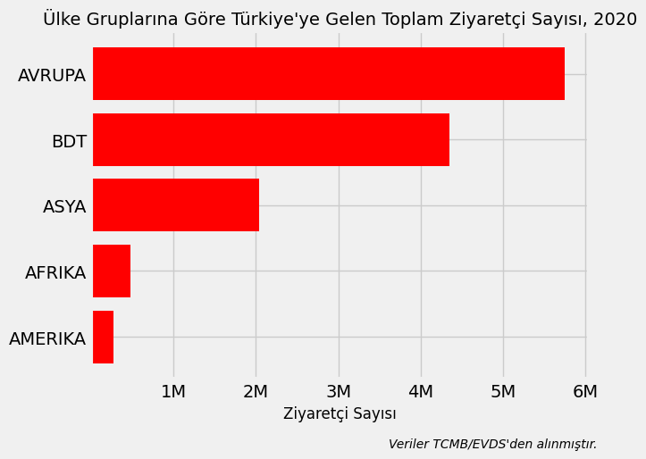

# 5. Multi-set Bar Chart

---

Veri: `multisetbarchart_data.xlsx` (veriye [buradan](https://github.com/urazakgul/python-veri-gorsellestirme-dersleri/tree/main/data) ulaşabilirsiniz).

```python
import pandas as pd

df = pd.read_excel('./data/multisetbarchart_data.xlsx')
df.head()
```

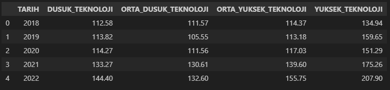

## 5.1. Matplotlib

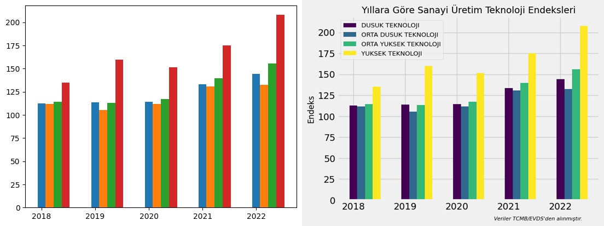

Basit bir grafik ile başlayalım.

```python
import matplotlib.pyplot as plt
import numpy as np

yillar = df['TARIH'].astype(str)
teknolojiler = df.columns.tolist()
teknolojiler.remove('TARIH')

yatay_eksen = np.arange(len(yillar))
bar_genislik = 0.15
bar_ara_mesafe = 0

for i, teknoloji in enumerate(teknolojiler):
    veriler = df[teknoloji]
    plt.bar(
        yatay_eksen + (bar_genislik + bar_ara_mesafe) * i,
        veriler,
        width=bar_genislik
    )

plt.xticks(yatay_eksen, yillar)
plt.show()
```

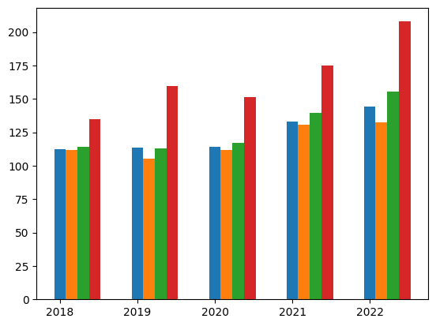

Başka neler yapabiliriz?

Renkleri değiştirebiliriz.

```python
import matplotlib.pyplot as plt
import numpy as np

yillar = df['TARIH'].astype(str)
teknolojiler = df.columns.tolist()
teknolojiler.remove('TARIH')

yatay_eksen = np.arange(len(yillar))
bar_genislik = 0.15
bar_ara_mesafe = 0

viridis_renk_paleti = plt.cm.viridis(np.linspace(0, 1, len(teknolojiler)))

for i, teknoloji in enumerate(teknolojiler):
    veriler = df[teknoloji]
    plt.bar(
        yatay_eksen + (bar_genislik + bar_ara_mesafe) * i,
        veriler,
        width=bar_genislik,
        color=viridis_renk_paleti[i]
    )

plt.xticks(yatay_eksen, yillar)
plt.show()
```

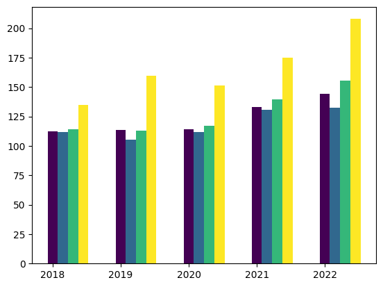

Dikey (y) eksenin etiketini belirtebilir; başlık ekleyebiliriz.

```python
import matplotlib.pyplot as plt
import numpy as np

yillar = df['TARIH'].astype(str)
teknolojiler = df.columns.tolist()
teknolojiler.remove('TARIH')

yatay_eksen = np.arange(len(yillar))
bar_genislik = 0.15
bar_ara_mesafe = 0

viridis_renk_paleti = plt.cm.viridis(np.linspace(0, 1, len(teknolojiler)))

for i, teknoloji in enumerate(teknolojiler):
    veriler = df[teknoloji]
    plt.bar(
        yatay_eksen + (bar_genislik + bar_ara_mesafe) * i,
        veriler,
        width=bar_genislik,
        color=viridis_renk_paleti[i]
    )

plt.xticks(yatay_eksen, yillar)
plt.ylabel('Endeks')
plt.title('Yıllara Göre Sanayi Üretim Teknoloji Endeksleri')
plt.show()
```

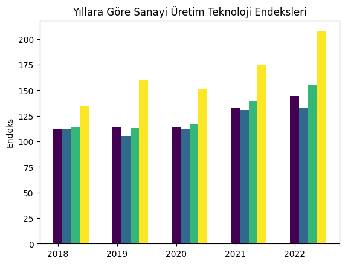

Alt tarafa bilgilendirme ekleyebiliriz.

```python
import matplotlib.pyplot as plt
import numpy as np

yillar = df['TARIH'].astype(str)
teknolojiler = df.columns.tolist()
teknolojiler.remove('TARIH')

yatay_eksen = np.arange(len(yillar))
bar_genislik = 0.15
bar_ara_mesafe = 0

viridis_renk_paleti = plt.cm.viridis(np.linspace(0, 1, len(teknolojiler)))

for i, teknoloji in enumerate(teknolojiler):
    veriler = df[teknoloji]
    plt.bar(
        yatay_eksen + (bar_genislik + bar_ara_mesafe) * i,
        veriler,
        width=bar_genislik,
        color=viridis_renk_paleti[i]
    )

plt.xticks(yatay_eksen, yillar)
plt.ylabel('Endeks')
plt.title('Yıllara Göre Sanayi Üretim Teknoloji Endeksleri')
plt.figtext(0.6, -0.02, 'Veriler TCMB/EVDS\'den alınmıştır.', ha='left', fontsize='8', fontstyle='italic')
plt.show()
```

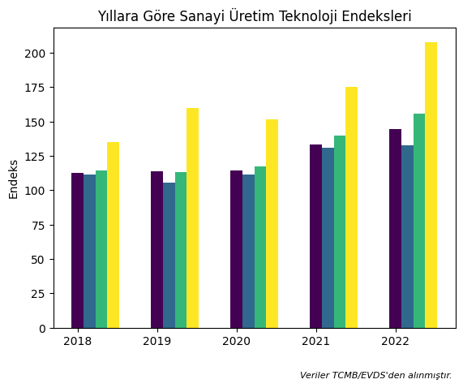

Lejant ekleyebiliriz.

```python
import matplotlib.pyplot as plt
import numpy as np

yillar = df['TARIH'].astype(str)
teknolojiler = df.columns.tolist()
teknolojiler.remove('TARIH')

yatay_eksen = np.arange(len(yillar))
bar_genislik = 0.15
bar_ara_mesafe = 0

viridis_renk_paleti = plt.cm.viridis(np.linspace(0, 1, len(teknolojiler)))

for i, teknoloji in enumerate(teknolojiler):
    veriler = df[teknoloji]
    plt.bar(
        yatay_eksen + (bar_genislik + bar_ara_mesafe) * i,
        veriler,
        width=bar_genislik,
        color=viridis_renk_paleti[i],
        label=teknoloji
    )

plt.xticks(yatay_eksen, yillar)
plt.ylabel('Endeks')
plt.title('Yıllara Göre Sanayi Üretim Teknoloji Endeksleri')
plt.figtext(0.6, -0.02, 'Veriler TCMB/EVDS\'den alınmıştır.', ha='left', fontsize='8', fontstyle='italic')
plt.legend()
plt.show()
```


Lejantı küçültebiliriz. Profesyonel durmadığı için etiketlerdeki alt çizgileri kaldırabiliriz.

```python
import matplotlib.pyplot as plt
import numpy as np

yillar = df['TARIH'].astype(str)
teknolojiler = df.columns.tolist()
teknolojiler.remove('TARIH')

yatay_eksen = np.arange(len(yillar))
bar_genislik = 0.15
bar_ara_mesafe = 0

viridis_renk_paleti = plt.cm.viridis(np.linspace(0, 1, len(teknolojiler)))

for i, teknoloji in enumerate(teknolojiler):
    veriler = df[teknoloji]
    plt.bar(
        yatay_eksen + (bar_genislik + bar_ara_mesafe) * i,
        veriler,
        width=bar_genislik,
        color=viridis_renk_paleti[i],
        label=teknoloji.replace('_',' ')
    )

plt.xticks(yatay_eksen, yillar)
plt.ylabel('Endeks')
plt.title('Yıllara Göre Sanayi Üretim Teknoloji Endeksleri')
plt.figtext(0.6, -0.02, 'Veriler TCMB/EVDS\'den alınmıştır.', ha='left', fontsize='8', fontstyle='italic')
plt.legend(fontsize='x-small')
plt.show()
```

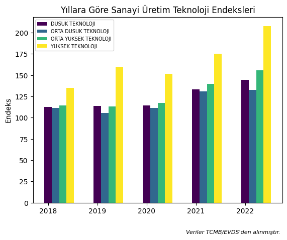

Temayı değiştirebiliriz. Tema değiştiği için eksenlere ait etiketleri ve başlığı küçültebiliriz.

```python
import matplotlib.pyplot as plt
import numpy as np

plt.style.use('fivethirtyeight')

yillar = df['TARIH'].astype(str)
teknolojiler = df.columns.tolist()
teknolojiler.remove('TARIH')

yatay_eksen = np.arange(len(yillar))
bar_genislik = 0.15
bar_ara_mesafe = 0

viridis_renk_paleti = plt.cm.viridis(np.linspace(0, 1, len(teknolojiler)))

for i, teknoloji in enumerate(teknolojiler):
    veriler = df[teknoloji]
    plt.bar(
        yatay_eksen + (bar_genislik + bar_ara_mesafe) * i,
        veriler,
        width=bar_genislik,
        color=viridis_renk_paleti[i],
        label=teknoloji.replace('_',' ')
    )

plt.xticks(yatay_eksen, yillar)
plt.ylabel('Endeks', fontsize='12')
plt.title('Yıllara Göre Sanayi Üretim Teknoloji Endeksleri', fontsize='14')
plt.figtext(0.6, -0.02, 'Veriler TCMB/EVDS\'den alınmıştır.', ha='left', fontsize='8', fontstyle='italic')
plt.legend(fontsize='x-small')
plt.show()
```

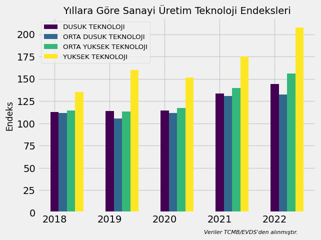

# 6. Stacked Bar Graph

---

Veri: `stackedbargraph_data.xlsx` (veriye [buradan](https://github.com/urazakgul/python-veri-gorsellestirme-dersleri/tree/main/data) ulaşabilirsiniz).

```python
import pandas as pd

df = pd.read_excel('./data/stackedbargraph_data.xlsx')
df.head()
```

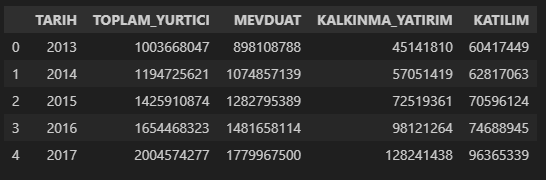

## 6.1. Matplotlib

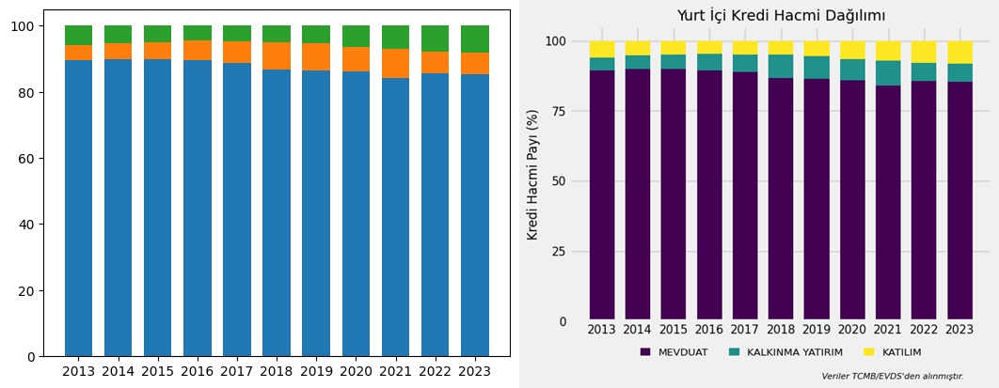

Basit bir grafik ile başlayalım.

```python
import matplotlib.pyplot as plt
import numpy as np

yillar = df['TARIH'].astype(str)
df.drop('TARIH', axis=1, inplace=True)

df.drop('TOPLAM_YURTICI', axis=1, inplace=True)

df_yuzde = df.div(df.sum(axis=1), axis=0) * 100

bankalar = df.columns.tolist()

yatay_eksen = np.arange(len(yillar))
bar_genislik = 0.7
bar_ara_mesafe = 0

taban = np.zeros(len(yillar))

for i, banka in enumerate(bankalar):
    veriler = df_yuzde[banka]
    plt.bar(
        yatay_eksen,
        veriler,
        width=bar_genislik,
        bottom=taban
    )
    taban += veriler

plt.xticks(yatay_eksen, yillar)
plt.show()
```

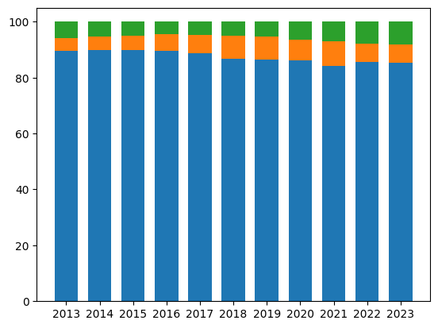

Başka neler yapabiliriz?

Renkleri değiştirebiliriz.

```python
import matplotlib.pyplot as plt
import numpy as np

yillar = df['TARIH'].astype(str)
df.drop('TARIH', axis=1, inplace=True)

df.drop('TOPLAM_YURTICI', axis=1, inplace=True)

df_yuzde = df.div(df.sum(axis=1), axis=0) * 100

bankalar = df.columns.tolist()

yatay_eksen = np.arange(len(yillar))
bar_genislik = 0.7
bar_ara_mesafe = 0

taban = np.zeros(len(yillar))

viridis_renk_paleti = plt.cm.viridis(np.linspace(0, 1, len(bankalar)))

for i, banka in enumerate(bankalar):
    veriler = df_yuzde[banka]
    plt.bar(
        yatay_eksen,
        veriler,
        width=bar_genislik,
        bottom=taban,
        color=viridis_renk_paleti[i]
    )
    taban += veriler

plt.xticks(yatay_eksen, yillar)
plt.show()
```

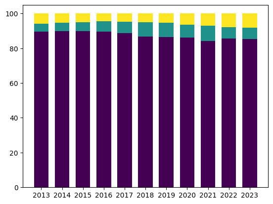

Dikey (y) eksenin etiketini belirtebilir; başlık ekleyebiliriz.

```python
import matplotlib.pyplot as plt
import numpy as np

yillar = df['TARIH'].astype(str)
df.drop('TARIH', axis=1, inplace=True)

df.drop('TOPLAM_YURTICI', axis=1, inplace=True)

df_yuzde = df.div(df.sum(axis=1), axis=0) * 100

bankalar = df.columns.tolist()

yatay_eksen = np.arange(len(yillar))
bar_genislik = 0.7
bar_ara_mesafe = 0

taban = np.zeros(len(yillar))

viridis_renk_paleti = plt.cm.viridis(np.linspace(0, 1, len(bankalar)))

for i, banka in enumerate(bankalar):
    veriler = df_yuzde[banka]
    plt.bar(
        yatay_eksen,
        veriler,
        width=bar_genislik,
        bottom=taban,
        color=viridis_renk_paleti[i]
    )
    taban += veriler

plt.xticks(yatay_eksen, yillar)
plt.ylabel('Kredi Hacmi Payı (%)')
plt.title('Yurt İçi Kredi Hacmi Dağılımı')
plt.show()
```

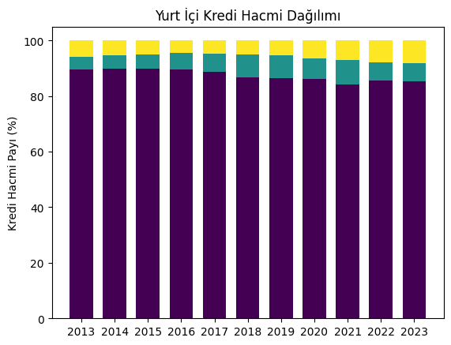

Dikey (y) eksendeki değerleri 25'er olacak şekilde atlatabiliriz.

```python
import matplotlib.pyplot as plt
import numpy as np

yillar = df['TARIH'].astype(str)
df.drop('TARIH', axis=1, inplace=True)

df.drop('TOPLAM_YURTICI', axis=1, inplace=True)

df_yuzde = df.div(df.sum(axis=1), axis=0) * 100

bankalar = df.columns.tolist()

yatay_eksen = np.arange(len(yillar))
bar_genislik = 0.7
bar_ara_mesafe = 0

taban = np.zeros(len(yillar))

viridis_renk_paleti = plt.cm.viridis(np.linspace(0, 1, len(bankalar)))

for i, banka in enumerate(bankalar):
    veriler = df_yuzde[banka]
    plt.bar(
        yatay_eksen,
        veriler,
        width=bar_genislik,
        bottom=taban,
        color=viridis_renk_paleti[i]
    )
    taban += veriler

plt.xticks(yatay_eksen, yillar)
plt.yticks([0, 25, 50, 75, 100])
plt.ylabel('Kredi Hacmi Payı (%)')
plt.title('Yurt İçi Kredi Hacmi Dağılımı')
plt.show()
```


Alt tarafa bilgilendirme ekleyebiliriz.

```python
import matplotlib.pyplot as plt
import numpy as np

yillar = df['TARIH'].astype(str)
df.drop('TARIH', axis=1, inplace=True)

df.drop('TOPLAM_YURTICI', axis=1, inplace=True)

df_yuzde = df.div(df.sum(axis=1), axis=0) * 100

bankalar = df.columns.tolist()

yatay_eksen = np.arange(len(yillar))
bar_genislik = 0.7
bar_ara_mesafe = 0

taban = np.zeros(len(yillar))

viridis_renk_paleti = plt.cm.viridis(np.linspace(0, 1, len(bankalar)))

for i, banka in enumerate(bankalar):
    veriler = df_yuzde[banka]
    plt.bar(
        yatay_eksen,
        veriler,
        width=bar_genislik,
        bottom=taban,
        color=viridis_renk_paleti[i]
    )
    taban += veriler

plt.xticks(yatay_eksen, yillar)
plt.yticks([0, 25, 50, 75, 100])
plt.ylabel('Kredi Hacmi Payı (%)')
plt.title('Yurt İçi Kredi Hacmi Dağılımı')
plt.figtext(0.6, -0.02, 'Veriler TCMB/EVDS\'den alınmıştır.', ha='left', fontsize='8', fontstyle='italic')
plt.show()
```

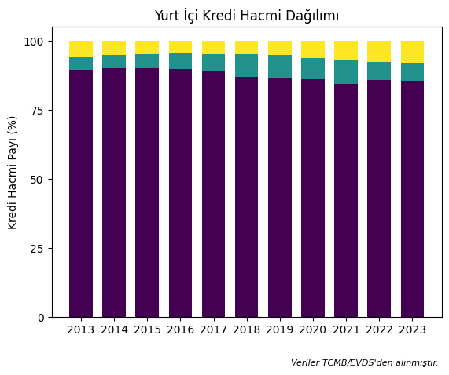

Lejant ekleyebiliriz.

```python
import matplotlib.pyplot as plt
import numpy as np

yillar = df['TARIH'].astype(str)
df.drop('TARIH', axis=1, inplace=True)

df.drop('TOPLAM_YURTICI', axis=1, inplace=True)

df_yuzde = df.div(df.sum(axis=1), axis=0) * 100

bankalar = df.columns.tolist()

yatay_eksen = np.arange(len(yillar))
bar_genislik = 0.7
bar_ara_mesafe = 0

taban = np.zeros(len(yillar))

viridis_renk_paleti = plt.cm.viridis(np.linspace(0, 1, len(bankalar)))

for i, banka in enumerate(bankalar):
    veriler = df_yuzde[banka]
    plt.bar(
        yatay_eksen,
        veriler,
        width=bar_genislik,
        bottom=taban,
        color=viridis_renk_paleti[i],
        label=banka
    )
    taban += veriler

plt.xticks(yatay_eksen, yillar)
plt.yticks([0, 25, 50, 75, 100])
plt.ylabel('Kredi Hacmi Payı (%)')
plt.title('Yurt İçi Kredi Hacmi Dağılımı')
plt.figtext(0.6, -0.02, 'Veriler TCMB/EVDS\'den alınmıştır.', ha='left', fontsize='8', fontstyle='italic')
plt.legend()
plt.show()
```

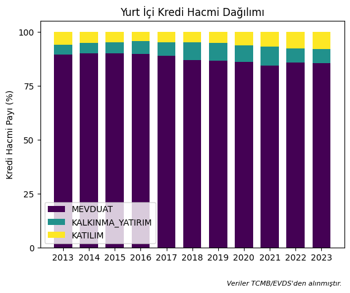

Lejantı yatay (x) eksenin altına alabiliriz.

```python
import matplotlib.pyplot as plt
import numpy as np

yillar = df['TARIH'].astype(str)
df.drop('TARIH', axis=1, inplace=True)

df.drop('TOPLAM_YURTICI', axis=1, inplace=True)

df_yuzde = df.div(df.sum(axis=1), axis=0) * 100

bankalar = df.columns.tolist()

yatay_eksen = np.arange(len(yillar))
bar_genislik = 0.7
bar_ara_mesafe = 0

taban = np.zeros(len(yillar))

viridis_renk_paleti = plt.cm.viridis(np.linspace(0, 1, len(bankalar)))

for i, banka in enumerate(bankalar):
    veriler = df_yuzde[banka]
    plt.bar(
        yatay_eksen,
        veriler,
        width=bar_genislik,
        bottom=taban,
        color=viridis_renk_paleti[i],
        label=banka
    )
    taban += veriler

plt.xticks(yatay_eksen, yillar)
plt.yticks([0, 25, 50, 75, 100])
plt.ylabel('Kredi Hacmi Payı (%)')
plt.title('Yurt İçi Kredi Hacmi Dağılımı')
plt.figtext(0.6, -0.05, 'Veriler TCMB/EVDS\'den alınmıştır.', ha='left', fontsize='8', fontstyle='italic')
plt.legend(loc='upper center', ncol=len(bankalar), bbox_to_anchor=(0.5, -0.06))
plt.show()
```

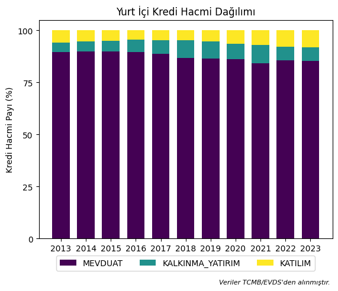

Lejantın etrafındaki çizgiyi kaldırabiliriz. Aynı zamanda alt çizgileri kaldırabiliriz.

```python
import matplotlib.pyplot as plt
import numpy as np

yillar = df['TARIH'].astype(str)
df.drop('TARIH', axis=1, inplace=True)

df.drop('TOPLAM_YURTICI', axis=1, inplace=True)

df_yuzde = df.div(df.sum(axis=1), axis=0) * 100

bankalar = df.columns.tolist()

yatay_eksen = np.arange(len(yillar))
bar_genislik = 0.7
bar_ara_mesafe = 0

taban = np.zeros(len(yillar))

viridis_renk_paleti = plt.cm.viridis(np.linspace(0, 1, len(bankalar)))

for i, banka in enumerate(bankalar):
    veriler = df_yuzde[banka]
    plt.bar(
        yatay_eksen,
        veriler,
        width=bar_genislik,
        bottom=taban,
        color=viridis_renk_paleti[i],
        label=banka.replace('_',' ')
    )
    taban += veriler

plt.xticks(yatay_eksen, yillar)
plt.yticks([0, 25, 50, 75, 100])
plt.ylabel('Kredi Hacmi Payı (%)')
plt.title('Yurt İçi Kredi Hacmi Dağılımı')
plt.figtext(0.6, -0.05, 'Veriler TCMB/EVDS\'den alınmıştır.', ha='left', fontsize='8', fontstyle='italic')
plt.legend(loc='upper center', ncol=len(bankalar), bbox_to_anchor=(0.5, -0.06), frameon=False)
plt.show()
```


Temayı değiştirebiliriz. Tema değiştiği için eksenlere ait etiketleri ve başlığı küçültebiliriz.

```python
import matplotlib.pyplot as plt
import numpy as np

plt.style.use('fivethirtyeight')

yillar = df['TARIH'].astype(str)
df.drop('TARIH', axis=1, inplace=True)

df.drop('TOPLAM_YURTICI', axis=1, inplace=True)

df_yuzde = df.div(df.sum(axis=1), axis=0) * 100

bankalar = df.columns.tolist()

yatay_eksen = np.arange(len(yillar))
bar_genislik = 0.7
bar_ara_mesafe = 0

taban = np.zeros(len(yillar))

viridis_renk_paleti = plt.cm.viridis(np.linspace(0, 1, len(bankalar)))

for i, banka in enumerate(bankalar):
    veriler = df_yuzde[banka]
    plt.bar(
        yatay_eksen,
        veriler,
        width=bar_genislik,
        bottom=taban,
        color=viridis_renk_paleti[i],
        label=banka.replace('_',' ')
    )
    taban += veriler

plt.xticks(yatay_eksen, yillar, fontsize='11')
plt.yticks([0, 25, 50, 75, 100], fontsize='11')
plt.ylabel('Kredi Hacmi Payı (%)', fontsize='12')
plt.title('Yurt İçi Kredi Hacmi Dağılımı', fontsize='14')
plt.figtext(0.6, -0.09, 'Veriler TCMB/EVDS\'den alınmıştır.', ha='left', fontsize='8', fontstyle='italic')
plt.legend(loc='upper center', ncol=len(bankalar), bbox_to_anchor=(0.5, -0.06), frameon=False, handlelength=1, fontsize='x-small')
plt.show()
```

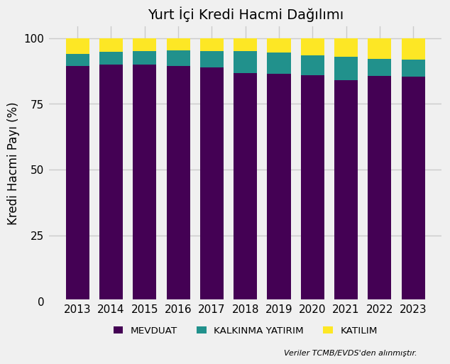